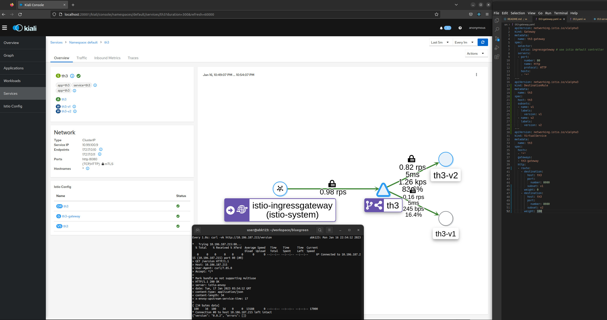

# Blue-Green Deployment for th3.py Application

These instructions are for a fresh Ubuntu Desktop 22.10 x86_64 environment (in my case, running in VMware Workstation on Windows 10 64-bit).

## Installing Dependencies

### 1) Docker
see: https://docs.docker.com/engine/install/ubuntu/

```bash
sudo apt-get update
sudo apt-get install ca-certificates curl gnupg lsb-release
sudo mkdir -p /etc/apt/keyrings
curl -fsSL https://download.docker.com/linux/ubuntu/gpg | sudo gpg --dearmor -o /etc/apt/keyrings/docker.gpg
echo "deb [arch=$(dpkg --print-architecture) signed-by=/etc/apt/keyrings/docker.gpg] https://download.docker.com/linux/ubuntu \
  $(lsb_release -cs) stable" | sudo tee /etc/apt/sources.list.d/docker.list > /dev/null
sudo apt-get update
sudo apt-get install docker-ce docker-ce-cli containerd.io docker-compose-plugin
```

Verify

```bash
docker -v
# Docker version 20.10.22, build 3a2c30b
docker ps
```

### 2) Minikube
see: https://minikube.sigs.k8s.io/docs/start/

```bash
curl -LO https://storage.googleapis.com/minikube/releases/latest/minikube-linux-amd64
sudo install minikube-linux-amd64 /usr/local/bin/minikube
```

Verify

```bash
minikube version
# minikube version: v1.28.0
# commit: 986b1ebd987211ed16f8cc10aed7d2c42fc8392f
minikube start
minikube status
```

### 3) kubectl
see: https://kubernetes.io/docs/tasks/tools/install-kubectl-linux/

```bash
curl -LO "https://dl.k8s.io/release/$(curl -L -s https://dl.k8s.io/release/stable.txt)/bin/linux/amd64/kubectl"
sudo install kubectl /usr/local/bin/kubectl
```

Verify

```bash
kubectl version --short
# Client Version: v1.26.0
# Kustomize Version: v4.5.7
# Server Version: v1.25.3
kubectl get pods -A
```

### 4) Istio
see: https://istio.io/latest/docs/setup/platform-setup/minikube/

```bash
curl -L https://git.io/getLatestIstio | sh -
sudo install istio-1.16.1/bin/istioctl /usr/local/bin/istioctl
```

Verify

```bash
istioctl version
# client version: 1.16.1
# control plane version: 1.16.1
# data plane version: 1.16.1 (2 proxies)
```

Since we want minikube to provide a load balancer, for use by Istio,
we launch tunnel.

```bash
# this process will remain running in foreground; kill it to end the tunnel (at the very end)
minikube tunnel
```

Now we configure Istio

```bash
# Run a pre-check to inspect if the cluster meets the requirements to install Istio.
istioctl experimental precheck

# Install Istio in the Kubernetes cluster
istioctl install --set profile=demo -y

# List the resources created in the istio-system namespace
kubectl get deployments,pods -n istio-system

# Get the services in the istio-system namespace
kubectl get services -n istio-system

# Get the Istio ingress IP address and HTTP/HTTPS ports
export INGRESS_HOST=$(kubectl get service \
  istio-ingressgateway -n istio-system \
  -o jsonpath='{.status.loadBalancer.ingress[0].ip}')
export INGRESS_PORT=$(kubectl get service \
  istio-ingressgateway -n istio-system \
  -o jsonpath='{.spec.ports[?(@.name=="http2")].port}')
export SECURE_INGRESS_PORT=$(kubectl get service \
  istio-ingressgateway -n istio-system \
  -o jsonpath='{.spec.ports[?(@.name=="https")].port}')
export GATEWAY_URL="${INGRESS_HOST}:${INGRESS_PORT}"
printenv GATEWAY_URL # 10.111.124.178:80
```

Now we install some helpful services to provide detailed monitoring

```bash
# List the add-ons provided with the Istio release
ls istio-*/samples/addons
# extras  grafana.yaml  jaeger.yaml  kiali.yaml  prometheus.yaml  README.md

# Apply the resource manifests for the Istio add-ons (optional)
# (mainly the kiali dashboard is nice)
kubectl apply -f istio-*/samples/addons
```

View real-time detailed metrics via the beautiful Istio Kiali dashboard

```bash
# this process will remain running in foreground; kill it to end dashboard service
istioctl dashboard kiali
# http://10.111.124.178:20001/kiali
```

## Configuration

Push our application container image to Minikube Docker Engine.

see also: [src/README.md](src/)

```bash
cd src/
eval $(minikube docker-env)
docker build -t th3:v0.0.1 .
# edit app, then bump version
docker build -t th3:v0.0.2 .
cd ..
```

Launch our sample application.

```bash
kubectl label namespace default istio-injection=enabled --overwrite
# namespace/default labeled
kubectl apply -f src/th3.yaml
# service/th3 created
# deployment.apps/th3-v1 created
# deployment.apps/th3-v2 created

# Verify deployment and pod are ready
kubectl get deployments,pods -l app=th3

# Verify that the service is present
kubectl get services -l app=th3

# Create the gateway and virtual service to access the example application
kubectl apply -f src/th3-gateway.yaml
# gateway.networking.istio.io/th3-gateway created
# destinationrule.networking.istio.io/th3 created
# virtualservice.networking.istio.io/th3 created

# Verify that the gateway and virtual service resources are deployed
kubectl get gateways,virtualservices
```

Verify

```bash
kubectl get gateways
kubectl get virtualservices
kubectl get all -l app=th3
```

```bash
curl -vk http://${GATEWAY_URL}/version
# {"version": "0.0.1", "errors": []}
curl -vk http://${GATEWAY_URL}/api/v1/translate?phrase=Well%20Met
# {"phrase": "Well Met", "translation": "Throm-Ka", "errors": []}
```

## Ongoing Load Test

```bash
# Generate traffic for the example application
# this process will remain running in the foreground; kill it to end load test
sh loadgen.sh > load-test.out
```

Watch the dashboard to see the load being routed and distributed.


If there were any errors, the log may appear like so (errors, blank lines):
```
Mon Jan 16 11:07:07 PM MST 2023 no healthy upstream
Mon Jan 16 11:07:07 PM MST 2023
```

## Blue-Green Deploy

Modify [src/th3-gateway.yaml](src/th3-gateway.yaml) so the `weight` is aimed at the desired version.
Then submit the updated definition.

```bash
kubectl replace -f src/th3-gateway.yaml
```

Success!

## Cleanup

When you're done looking, you can free resources.

```bash
kubectl delete gateway th3-gateway
kubectl delete virtualservice th3
kubectl delete all -l app=th3
kubectl label namespace default istio-injection-
minikube delete
```

## References:

- https://thenewstack.io/tutorial-blue-green-deployments-with-kubernetes-and-istio/
- https://istio.io/latest/docs/reference/config/networking/virtual-service/
- https://stackoverflow.com/questions/42564058/how-to-use-local-docker-images-with-minikube


## Screenshots

